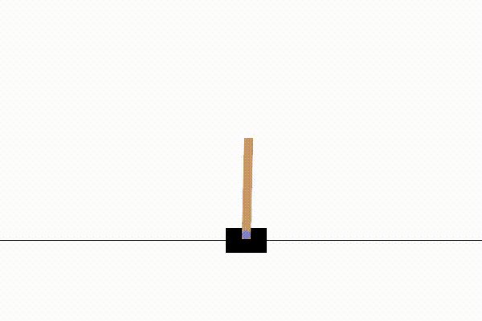
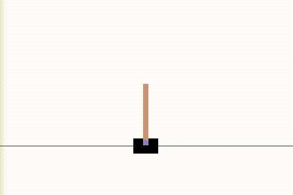

# Intro
I wanted to explore if GPT was able to use human feedback (in natural language) to tune a PID/LQR controller. The idea is for the human not to be a control expert and not to be able to specify things as "Increase the derivative gain to reduce oscillations",  but rather to give higher level (and sometimes even ambiguous) observations on what is happening and what he wants to happen.


I observe that LQR is more intuitive to tune to GPT. Not unreasonably, LQR was easier for me to tune as well. I speculate this to occur due to the fact that reasoning about penalizing the cost of a specicifc state is more intuitive than reasoning on the systems response with PID gains. 

One reason for using human language to convey satisfaction about the performance of an optimization problem is that humans don't care about the optimal solution of "the" optimal solution, but rather, they care about the system behaving as the human wishes. The cost function in an optimization problem is simply the mathematical realization of the human's wishes. LQR is an optimization problem and as such it specifies a cost function that is devised and interpretable by humans. 

If cost functions are human interpretable, why do we need a language model to update them? Well, cost functions are usually interpretable by a few humans, those who wrote them, and require some expert knowledge and rules of thumb on how a change in a cost function affects the systems behavior. Moreover, especially when working in realtime, we may want a system to behave in ways it was not predefined to. Having general knowledge on the system costs gives an interface on how to make it behave in this ways it was not hardcoded to.   

# Example: Controlling an inverted pendulum

### Before tuning

### After tuning



## User - GPT Discussion
User:  The pendulum is not staying upright. The cart moves left and right to try and keep the pendulum stable but after few seconds the pendulum just falls
  
GPT: It seems like the pendulum is not being controlled effectively, so I will increase the gain of the theta state to provide a stronger reaction to the pendulum's deviation from the upright position.

Update parameter:
```
update('theta', 10.0)
```

Increasing the gain of the theta state will give more emphasis on the pendulum's angle in the controller, which in turn helps to keep the pendulum upright. 

User: It hasn't changed much and the pendulum still falls

GPT: In that case, I will try to increase the gain of the angular velocity (dtheta) parameter. This should help the controller react faster to changes in the pendulum's angular velocity and apply necessary forces to keep it balanced.

Update parameter:
```
update('dtheta', 10.0)
```
By increasing the gain for the angular velocity of the pendulum, the controller will respond more aggressively to changes in angular velocity and should be able to stabilize the pendulum more effectively. 

User: It is better, now the cart is oscillating left and right to keep the pendulum upright however the oscillations increase slowly until the pendulum falls
 
GPT: It seems like the cart might be reacting too aggressively, causing it to overshoot and destabilize the pendulum. I will decrease the gain of the cart position (x) to reduce its oscillations.

Update parameter:
```
update('x', 0.5)
```
By reducing the gain for the cart's position (x), we will make the cart's movements less aggressive, which should help prevent the overshooting behavior and the increasing oscillations that eventually lead to the pendulum falling. 

User: Yes it has improve! Now it oscillates less but the oscillations still slowly increase making the pendulum fall
 
GPT: To further address the increasing oscillations, I will now decrease the gain of the cart's velocity (dx) to make the cart's movements smoother and more controlled.

Update parameter:
```
update('dx', 0.5)
```
By reducing the gain for the cart's velocity (dx), we expect the cart to react less aggressively to changes in its velocity, which should help reduce the oscillations and make the system more stable over time. 


User: Still the oscillations increase until the pendulum falls down
 
GPT: Let's make another attempt to reduce the oscillations and stabilize the pendulum by further decreasing the gains of both the cart position (x) and the cart velocity (dx).

First, I'll decrease the gain for the cart position (x) again.

Update parameter:
```
update('x', 0.25)
```
By lowering the gain for cart position (x), we want the cart's movements to be even less aggressive, further reducing the oscillations and potential overshooting.
Next episode, I'll also decrease the gain for the cart velocity (dx) if the improvements are still insufficient. 

User: The oscillations increase more slowly but after some time they still become big and the pendulum falls down
 
GPT: Since the oscillations are still increasing over time, I will now also further decrease the gain for the cart velocity (dx) as I mentioned in my previous response.

Update parameter:
```
update('dx', 0.25)
```
By reducing the gain of the cart velocity (dx) even more, we expect the cart to react less aggressively to changes in its velocity, which should help stabilize the pendulum by further reducing the oscillations and preventing the pendulum from falling. 

User: The oscillations are even smaller but they still increase slowly leading the pendulum to fall. I want the pendulum to be totally fixed upright
 
GPT: To further stabilize the pendulum and minimize oscillations, I will revert the gains of cart position (x) and cart velocity (dx) to 0.5 and increase the gains of the theta and dtheta states to provide a stronger reaction for keeping the pendulum upright.

First, I will update the cart position (x) gain back to 0.5.

Update parameter:
```
update('x', 0.5)
```

Next, I will update the cart velocity (dx) gain back to 0.5.

Update parameter:
```
update('dx', 0.5)
```

Then, I will increase the gain of the pendulum angle (theta) to further emphasize its stability.

Update parameter:
```
update('theta', 20.0)
```

Lastly, I will increase the gain of the pendulum angular velocity (dtheta) to provide even faster reactions to the pendulum's movement.

Update parameter:
```
update('dtheta', 20.0)
```

By changing the gains of these states, we aim to further stabilize the pendulum by focusing more on its angle and angular velocity while maintaining a reasonable level of control for cart position and velocity. This combination should help keep the pendulum fixed upright and minimize oscillations. 

User: you can only update 1 parameter each time. Now you updated x
 
GPT: I apologize for the confusion. I will provide updates for each parameter one at a time.

Since I have already updated the cart position (x) gain to 0.5, let's proceed to the next step.

For this episode, I will update the cart velocity (dx) gain back to 0.5.

Update parameter:
```
update('dx', 0.5)
```
Reverting 'dx' gain back to 0.5 will help maintain a reasonable level of control for the cart's velocity, balancing cart movement while attempting to keep the pendulum upright. We will further update the other parameters in subsequent episodes. 

User: Ok go ahead
 
GPT: Thank you for your understanding. Now that we have updated the gains for the cart position (x) and cart velocity (dx), let's move on to increasing the gain of the pendulum angle (theta) to further emphasize its stability.

Update parameter:
```
update('theta', 20.0)
```
By increasing the gain of the pendulum angle (theta), we aim to provide a stronger reaction for maintaining the pendulum's stability, which should help keep it fixed upright and minimize oscillations. After observing the results of this change, we will proceed to update the pendulum angular velocity (dtheta) gain. 

User: ok go ahead
 
GPT: Now that the gains for cart position (x), cart velocity (dx), and pendulum angle (theta) have been updated, I will move on to increasing the gain of the pendulum angular velocity (dtheta) to provide even faster reactions to the pendulum's movement.

Update parameter:
```
update('dtheta', 20.0)
```
By increasing the gain of the pendulum angular velocity (dtheta), we aim to enhance the controller's ability to react more quickly to changes in the pendulum's movement. This should help further stabilize the pendulum, keeping it fixed upright and minimizing oscillations. 

User: Ok now the system has become stable and the pendulum does not fall anymore. Yet the cart oscillates a bit and I want it to not do that
 
GPT: Great, I'm glad to hear that the pendulum is stable. Now, to reduce the cart's oscillations, let's slightly decrease the gain of cart position (x) and cart velocity (dx) to make the cart's movements more controlled and smoother.

First, I will update the cart position (x) gain to 0.4.

Update parameter:
```
update('x', 0.4)
```
By decreasing the gain related to the cart position (x), we expect the cart's movements to be smoother, which should help reduce any residual oscillations. Once we observe the results of this change, we can make further adjustments if needed. 


